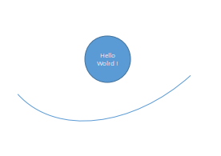
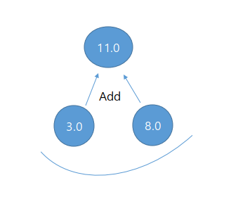
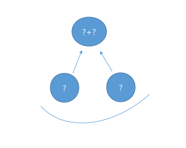

[CC] Code Contents
==========================
# Code Contents
### 1. "Hello World" 노드를 출력

<pre><code>import tensorflow as tf

#노드 생성
comment = 'Hello World!'
hello = tf.constant(comment)

#세션 선언
session = tf.Session()

#세션에서 hello 노드 실행
print(session.run(hello))
</code></pre>

### 2. 두 노드의 합을 계산

<pre><code>import tensorflow as tf

#두 숫자를 담고 있는 노드 선언
l_node = tf.constant (3.0, tf.float32)
r_node = tf.constant (8.0)

#합을 계산 하는 노드 선언
root_node = tf.add(l_node, r_node)

#세션 선언
session = tf.Session()

#세션에서 root_node 실행 
print(session.run(root_node))
</code></pre>

### 3. 미리 선언하지 않은 두 Integer32형 노드의 합을 계산 

<pre><code>import tensorflow as tf

l_node = tf.placeholder(tf.float32)
r_node = tf.placeholder(tf.float32)

root_node = l_node + r_node

session = tf.Session()

#사전 형태로 입력
print(session.run(root_node, feed_dict={l_node: 3, r_node: 3.5}))
print(session.run(root_node, feed_dict={l_node: [1,3], r_node: [2,4]}))
</code></pre>
