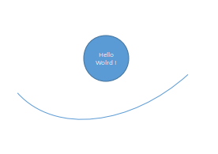
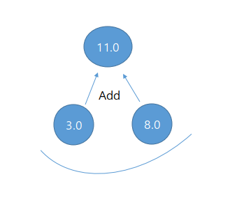
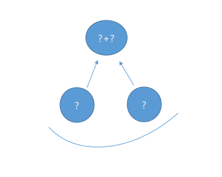
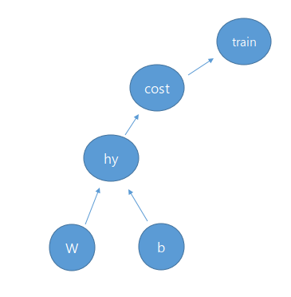

[CC] Code Contents
==========================
# Code Contents
### 1. "Hello World" 노드를 출력

<pre><code>import tensorflow as tf

#노드 생성
comment = 'Hello World!'
hello = tf.constant(comment)

#세션 선언
session = tf.Session()

#세션에서 hello 노드 실행
print(session.run(hello))
</code></pre>

### 2. 두 노드의 합을 계산

<pre><code>import tensorflow as tf

#두 숫자를 담고 있는 노드 선언
l_node = tf.constant (3.0, tf.float32)
r_node = tf.constant (8.0)

#합을 계산 하는 노드 선언
root_node = tf.add(l_node, r_node)

#세션 선언
session = tf.Session()

#세션에서 root_node 실행 
print(session.run(root_node))
</code></pre>

### 3. 미리 선언하지 않은 두 Integer32형 노드의 합을 계산 

<pre><code>import tensorflow as tf

l_node = tf.placeholder(tf.float32)
r_node = tf.placeholder(tf.float32)

root_node = l_node + r_node

session = tf.Session()

#사전 형태로 입력
print(session.run(root_node, feed_dict={l_node: 3, r_node: 3.5}))
print(session.run(root_node, feed_dict={l_node: [1,3], r_node: [2,4]}))
</code></pre>

### 4. Linear Regression을 활용한 결과 예측

<pre><code>import tensorflow as tf

x = [1, 4, 9]
y = [3, 9, 19]

# TensorFlow에서만 사용할 변수 선언
W = tf.Variable(tf.random_normal([1]), name='weight')
b = tf.Variable(tf.random_normal([1]), name='bias')

# 선형 함수
hypothesis = x * W + b

# reduce_mean : sigma / m
cost = tf.reduce_mean(tf.square(hypothesis - y))
optimizer = tf.train.GradientDescentOptimizer(learning_rate=0.005)
train = optimizer.minimize(cost)

#tf.Variable을 사용하려면 tf.global_variables_initializer() 호출 필요 
session = tf.Session()
session.run(tf.global_variables_initializer())

for step in range(1001):
    session.run(train)
    if step % 10 == 0:
        print(step, session.run(cost), session.run(W), session.run(b))

x = tf.placeholder(tf.float32, shape=[None])
y = tf.placeholder(tf.float32, shape=[None])

for step in range(1001):
    cost_val, W_val, b_val, train_val = session.run([cost, W, b, train], feed_dict={x: [1, 4, 9], y: [3, 9, 19]})
    if step % 10 == 0:
        print(step, cost_val, W_val, b_val)

print(session.run(hypothesis, feed_dict={x: [1, 4, 9]}))
</code></pre>

### 5. Minimizing Cost Gradient

<pre><code>import tensorflow as tf

x = [1, 2, 3]
y = [1, 2, 3]

W = tf.Variable(tf.random_normal([1]), name='weight')
X = tf.placeholder(tf.float32)
Y = tf.placeholder(tf.float32)

hypothesis = X * W

cost = tf.reduce_mean(tf.square(hypothesis - Y))

#아래 코드로 대체 가능
#optimizer = tf.train.GradientDescentOptimizer(learning_rate=0.005)
#train = optimizer.minimize(cost)

#Gradient Descent Algorithm
learning_rate = 0.01
gradient = tf.reduce_mean((W * X - Y) * X)
descent = W - learning_rate * gradient
update = W.assign(descent)

session = tf.Session()
session.run(tf.global_variables_initializer())

for step in range(100):
    session.run(update, feed_dict={X: x, Y : y})
    print(step, session.run(cost, feed_dict={X: x, Y : y}), session.run(W))
</code></pre>

### 6. Multi Variable Linear Regression
<pre><code>import tensorflow as tf

x = [[73., 80., 75.],
     [93., 88., 93.],
     [89., 91., 90.],
     [96., 98., 100.],
     [73., 66., 70.]]
y = [[152.],
     [185.],
     [180.],
     [196.],
     [142.]]

X = tf.placeholder(tf.float32, shape=[None, 3])
Y = tf.placeholder(tf.float32, shape=[None, 1])

W = tf.Variable(tf.random_normal([3, 1]), name='weight')
b = tf.Variable(tf.random_normal([1]), name='bias')

hypothesis = tf.matmul(X, W) + b

cost = tf.reduce_mean(tf.square(hypothesis - Y))

optimizer = tf.train.GradientDescentOptimizer(learning_rate=1e-5)
train = optimizer.minimize(cost)

session = tf.Session()
session.run(tf.global_variables_initializer())

for step in range(2001):
    cost_val, hypothesis_val, _ = session.run(
        [cost, hypothesis, train], feed_dict={X: x, Y: y})
    if step % 10 == 0:
        print(step, cost_val, hypothesis_val)</code></pre>

### 7. Loading data from file
<pre><code>import tensorflow as tf
import numpy as np

# 텍스트 형태의 csv 파일을 호출
df = np.loadtxt('../../res/data/example/data-01-test-score.csv', delimiter=',', dtype=np.float32)

x = df[:, 0: -1]
y = df[:, [-1]]

X = tf.placeholder(tf.float32, shape=[None, 3])
Y = tf.placeholder(tf.float32, shape=[None, 1])

W = tf.Variable(tf.random_normal([3, 1]), name='weight')
b = tf.Variable(tf.random_normal([1]), name='bias')

hypothesis = tf.matmul(X, W) + b

cost = tf.reduce_mean(tf.square(hypothesis - Y))

optimizer = tf.train.GradientDescentOptimizer(learning_rate=1e-5)
train = optimizer.minimize(cost)

session = tf.Session()
session.run(tf.global_variables_initializer())

for step in range(2001):
    cost_val, hy_val, _ = session.run(
        [cost, hypothesis, train], feed_dict={X: x, Y: y})
    if step % 10 == 0:
        print(step, cost_val, hy_val)

print("test set : 100 70 101")
print(session.run(hypothesis, feed_dict={X: [[100, 70, 101]]}))
</code></pre>

### 8. Logistic Regression
<pre><code>import tensorflow as tf
import numpy as np

df = np.loadtxt('../../res/data/example/data-03-diabetes.csv', delimiter=',', dtype=np.float32)

x = df[:, 0:-1]
y = df[:, [-1]]

X = tf.placeholder(tf.float32, shape=[None, x.shape[1]])
Y = tf.placeholder(tf.float32, shape=[None, y.shape[1]])

# W = tf.Variable(tf.random_normal([a, b]), name='weight')
# a = input 개수,  b = output 개수
W = tf.Variable(tf.random_normal([x.shape[1], y.shape[1]]), name='weight')
b = tf.Variable(tf.random_normal([1]), name='bias')

hypothesis = tf.sigmoid(tf.matmul(X, W) + b)
cost = tf.reduce_mean(-tf.reduce_sum(Y * tf.log(hypothesis)
                                     + (1 - Y) * tf.log(1 - hypothesis)))

# cost가 최소가 되도록 minimize 함수 설정
train = tf.train.GradientDescentOptimizer(learning_rate=0.01).minimize(cost)

# 정확도 측정
# 0.5보다 크면  predicted = 1 아니면 0
predicted = tf.cast(hypothesis > 0.5, dtype=tf.float32)
acc = tf.reduce_mean(tf.cast(tf.equal(predicted, Y), dtype=tf.float32))

with tf.Session() as session:
    session.run(tf.global_variables_initializer())

    for step in range(10001):
        cost_val, W_val, b_val, _ = session.run([cost, W, b, train], feed_dict={X: x, Y: y})

        if step % 200 == 0:
            print(step, cost_val, W_val, b_val)

    h, c, a = session.run([hypothesis, predicted, acc], feed_dict={X: x, Y: y})
    print(h, c, a)
</code></pre>