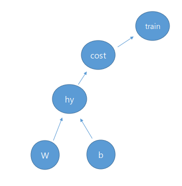

[CC] Code Contents
==========================
# Code Contents
### 1. "Hello World" 노드를 출력

<pre><code>import tensorflow as tf

#노드 생성
comment = 'Hello World!'
hello = tf.constant(comment)

#세션 선언
session = tf.Session()

#세션에서 hello 노드 실행
print(session.run(hello))
</code></pre>

### 2. 두 노드의 합을 계산

<pre><code>import tensorflow as tf

#두 숫자를 담고 있는 노드 선언
l_node = tf.constant (3.0, tf.float32)
r_node = tf.constant (8.0)

#합을 계산 하는 노드 선언
root_node = tf.add(l_node, r_node)

#세션 선언
session = tf.Session()

#세션에서 root_node 실행 
print(session.run(root_node))
</code></pre>

### 3. 미리 선언하지 않은 두 Integer32형 노드의 합을 계산 

<pre><code>import tensorflow as tf

l_node = tf.placeholder(tf.float32)
r_node = tf.placeholder(tf.float32)

root_node = l_node + r_node

session = tf.Session()

#사전 형태로 입력
print(session.run(root_node, feed_dict={l_node: 3, r_node: 3.5}))
print(session.run(root_node, feed_dict={l_node: [1,3], r_node: [2,4]}))
</code></pre>

### 4. Linear Regression을 활용한 결과 예측

 
<pre><code>import tensorflow as tf

x = [1, 4, 9]
y = [3, 9, 19]

# TensorFlow에서만 사용할 변수 선언
W = tf.Variable(tf.random_normal([1]), name='weight')
b = tf.Variable(tf.random_normal([1]), name='bias')

# 선형 함수
hypothesis = x * W + b

# reduce_mean : sigma / m
cost = tf.reduce_mean(tf.square(hypothesis - y))
optimizer = tf.train.GradientDescentOptimizer(learning_rate=0.005)
train = optimizer.minimize(cost)

#tf.Variable을 사용하려면 tf.global_variables_initializer() 호출 필요 
session = tf.Session()
session.run(tf.global_variables_initializer())

for step in range(1001):
    session.run(train)
    if step % 10 == 0:
        print(step, session.run(cost), session.run(W), session.run(b))

x = tf.placeholder(tf.float32, shape=[None])
y = tf.placeholder(tf.float32, shape=[None])

for step in range(1001):
    cost_val, W_val, b_val, train_val = session.run([cost, W, b, train], feed_dict={x: [1, 4, 9], y: [3, 9, 19]})
    if step % 10 == 0:
        print(step, cost_val, W_val, b_val)

print(session.run(hypothesis, feed_dict={x: [1, 4, 9]}))
</code></pre>
* shape : [" LearningRecord 2.4 Tensor란 "](https://github.com/sungwonkim-dev/MLS/blob/master/LearningRecord.md, "https://github.com/sungwonkim-dev/MLS/blob/master/LearningRecord.md")