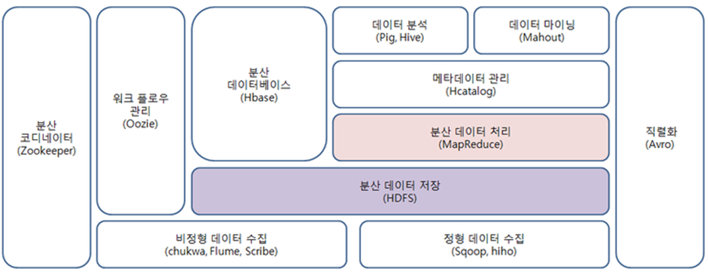
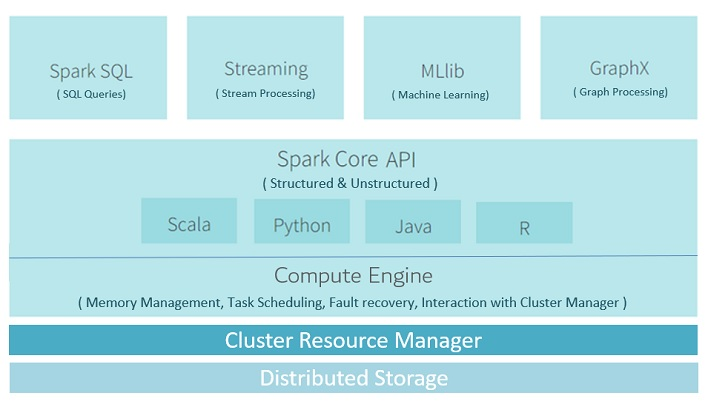

[DC] Data Campus
==========================
# 1. 빅데이터
## 1.1 빅데이터란?
    * 비정형 데이터
# 2. Hadoop
## 2.1 Hadoop이란?
    * 빅데이터 분산처리 플랫폼 
    
## 2.2  Hadoop Eco System

# 3. Spark
## 3.1 Spark란?
    * Streaming 형태의 
    빅데이터 분산처리 플랫폼
## 3.1 Spark Eco System

