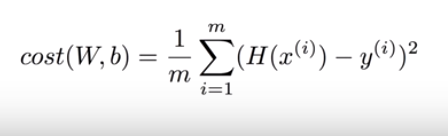

[MLS] Machine Learning Study
==========================
# 1. Machine Learning
## 1.1 Machine Learning이란?
    * 소프트웨어
    * 우리가 주로 사용하는 explicit program과 반대되는 개념
    * 프로그래머가 규칙을 정하는 것이 아닌 기계 스스로 규칙을 만듦

## 1.2 Machine Learning의 종류
### Supervised learning
    * 레이블화 된 데이터, 즉 training set을 가지고 학습하는 것
    * 대부분의 문제는 Supervised learning으로 해결할 수 있다.
        * regression
        * binary classification
        * multi-label classification

### UnSupervised learning
    * 레이블화 되지 않는 데이터를 가지고 학습하는 것
        * grouping
        * clustering

# 2. TensorFlow
## 2.1 TensorFlow란?
    * 오픈 소스 소프트웨어 라이브러리
    * Data Flow Graph를 이용한 Numerical computation
    * 파이썬에 최적화
    
## 2.2 Data Flow Graph란?
    * 흔히 생각하는 Graph와 생김새는 유사
    * Nodes (Operations), Edges (Data arrays, tensors)로 구성
    * Input과 Output이 있음

## 2.3 TensorFlow 내부 수행 순서
    1. TensorFlow opertaions을 사용한 Graph 생성
    2. Session 실행
    3. Graph 안에 존재하는 여러 값이 update되거나 return

## 2.4 Tensor란?
    * Scalar (magnitude only)
        * EX) s = 777
    * Vector (magnitude and direction)
        * EX) v = [1.2, 3.7, 9.3]
    * Matrix (table of numbers)
        * EX) m = [[1, 2, 3],[4, 5, 6]]
    * 3-Tensor (Cube of numbers)
        * EX) t = [[[1], [2], [3]], [[4], [5], [6]], [[7], [8], [9]]]
    * n-Tensor 
        * EX) Your imagination will help you..
        
# 3. Linear Regression
## 3.1 Linear Regression이란?
    * 선형 회귀
    * 1개 이상의 독립 변수와 종속 변수와의 선형 상관 관계를 모델링
        * EX) 공부 시간이 늘어날 수록 점수도 늘어난다.
        * EX) H(x) = Wx + b
    * Cost의 최소화가 학습 목표 

## 3.2 Cost Funtion
    * 가설과 결과의 일치 여부, 또는 차이를 계산

