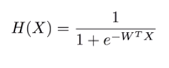

[MLS] Machine Learning Study
==========================
# 1. Machine Learning
## 1.1 Machine Learning이란?
    * 소프트웨어
    * 우리가 주로 사용하는 explicit program과 반대되는 개념
    * 프로그래머가 규칙을 정하는 것이 아닌 기계 스스로 규칙을 만듦

## 1.2 Machine Learning의 종류
### Supervised learning
    * 레이블화 된 데이터, 즉 training set을 가지고 학습하는 것
    * 대부분의 문제는 Supervised learning으로 해결할 수 있다.
        * regression
        * binary classification
        * multi-label classification
DataCampusLearningRecord
### UnSupervised learning
    * 레이블화 되지 않는 데이터를 가지고 학습하는 것
        * grouping
        * clustering

# 2. TensorFlow
## 2.1 TensorFlow란?
    * 오픈 소스 소프트웨어 라이브러리
    * Data Flow Graph를 이용한 Numerical computation
    * 파이썬에 최적화
    
## 2.2 Data Flow Graph란?
    * 흔히 생각하는 Graph와 생김새는 유사
    * Nodes (Operations), Edges (Data arrays, tensors)로 구성
    * Input과 Output이 있음

## 2.3 TensorFlow 내부 수행 순서
    1. TensorFlow opertaions을 사용한 Graph 생성
    2. Session 실행
    3. Graph 안에 존재하는 여러 값이 update되거나 return

## 2.4 Tensor란?
    * Scalar (magnitude only)
        * EX) s = 777
    * Vector (magnitude and direction)
        * EX) v = [1.2, 3.7, 9.3]
    * Matrix (table of numbers)
        * EX) m = [[1, 2, 3],[4, 5, 6]]
    * 3-Tensor (Cube of numbers)
        * EX) t = [[[1], [2], [3]], [[4], [5], [6]], [[7], [8], [9]]]
    * n-Tensor 
        * EX) Your imagination will help you..

## 2.S 유용한 TensorFlow 기능
### 2.S.1 Queue Runner

#### 2.S.1.1 Queue Runner는 언제 사용하는가?
    *  큰 데이터를 메모리에 참조하거나 메모리에 적재해야할 경우

#### 2.S.1.2 Queue Runner 예제
<pre><code># file1, file2, file3를 순서대로 참조
# skip(n) : n번째 줄까지 제외.
# repeat  : 파일의 끝에 도달하면 처음부터 반복.
# batch(n): n개의 데이터를 묶어서 사용.
iterator = tf.data.TextLineDataset("file1", "file2", "file3")
           .skip(1)
           .repeat()
           .batch(10)
           .make_initializable_iterator()

dataset = iterator.get_next()
lines = tf.decode_csv(dataset, record_defaults=[[0.], [0.], [0.], [0.]])

train_x_batch = tf.stack(lines[0:-1], axis=1)
train_y_batch = tf.stack(lines[-1:], axis=1)

# session.run(iterator.initializer)
</code></pre>
* 참고 : ["https://www.tensorflow.org/beta/guide/data"](https://www.tensorflow.org/beta/guide/data"https://www.tensorflow.org/beta/guide/data")

## 2.T 유용한 Tip
### 2.T.1 Learning Rate
    * Learning Rate ↑ -> Weight 변화율 ↑
        ∴ Overshooting 발생 확률 ↑
    * Learning Rate ↓ ->  Weight 변화율 ↓
        ∴ Local Minimum에서 멈출 확률 ↑
    
    ∴ Cost의 변화 측정을 통해 적절한 값으로 조정 필요
    
### 2.T.2  Standardization

  
    * X_std[:,0] = (X[:,0] - X[:,0].mean()) / X[:,0].std()
    
### 2.T.3 Overfitting

    * Training Data Set에 매우 최적화된 상태
    * Feature를 줄이거나 Regularization으로 해결 가능
        * Weight의 상한선을 정함
    * 학습 데이터로 학습   

* L2Regularization

### 2.T.4 Performance Evaluation
    * Original Set을 7:3 비율로 분할 (Training Set : Test Set) 
    * Original Set을 6:1:3 비율로 분할 (Training Set : Validation Set : Test Set)
        * Validation Set : 튜닝을 위한 데이터 셋
        
### 2.T.5 Online Learning
    * 다수의 데이터셋을 분할하여 학습

### 2.T.6 Initialize weight in a smart way
    * Bad way
        * Set all initial weight to 0 
            ∴ Gradient가 0이 되면서 전체가 0으로 변하게 됨
    * Good way
        1. Multi-layer 중 Input과 가까운 layer를 두 개씩 짝으로 생각한다.
        2. Input과 Weight에 대하여 Forward, Backward 연산을 반복하며 Input이 손실되지 않는 Weight를 구한다.
        3. 모든 layer에 적용한다.  
        
### 2.T.7 NN Dropout and Model Ensemble

       
### 2.T.W 자주 사용되는 단어
    * epoch : 설정한 데이터 셋을 전부 사용하는 루프 1번
    * batch size : 한 번에 사용할 데이터 셋의 크기

# 3. Linear Regression
## 3.1 Linear Regression이란?
    * 선형 회귀
    * 1개의 독립 변수와 종속 변수와의 선형 상관 관계를 모델링
        * EX) 공부 시간이 늘어날 수록 점수도 늘어난다.
        * EX) H(x) = Wx + b
    * Cost의 최소화가 학습 목표 

## 3.2 Cost Funtion
    * 가설과 결과의 일치 여부, 또는 차이를 계산

## 3.3 Gradient descent algorithm이란?
    * Cost Function의 최소화를 목적으로 한 알고리즘
    * ML 최소화 문제를 다루기 위해 주로 사용

### 3.3.1 어떻게 작동하는가?
    1 초기 추측으로 시작
        * (0, 0) 또는 임의의 x, y 값에서 시작 
        * W를 매우 조금 (Learning_rate) 변화시키며 Cost를 줄여감
    2 Parameter를 바꿔가며 가능한 최대한 Cost를 줄여나간다.
    3 지역 최소값에 도달할 때까지 반복
        * 기울기 > 0 ∴ W --
        * 기울기 < 0 ∴ W ++
* 참고 : ["모두를 위한 TensorFlow (3) Gradient descent algorithm 기본, 2017.02.17, peter_yun"](https://medium.com/@peteryun/ml-%EB%AA%A8%EB%91%90%EB%A5%BC-%EC%9C%84%ED%95%9C-tensorflow-3-gradient-descent-algorithm-%EA%B8%B0%EB%B3%B8-c0688208fc59 "https://medium.com/@peteryun/ml-%EB%AA%A8%EB%91%90%EB%A5%BC-%EC%9C%84%ED%95%9C-tensorflow-3-gradient-descent-algorithm-%EA%B8%B0%EB%B3%B8-c0688208fc59")

### 3.4 Linear Regression의 단점
    * 기울기(W)가 변함에 따라 일부 데이터에 대한 오판이 일어날 가능성이 크다.
 
# 4. Multi Variable Linear Regression

## 4.1 Multi Variable Linear Regression이란?
    * 2개 이상의 독립 변수와 종속 변수간의 상관 관계를 모델링

# 5. Logistic Classification
## 5.1 Logistic Classification이란?
    * Binary Classification의 다른 이름
    * 데이터를 1과 0의 두 가지 그룹으로 나누기 위해 사용하는 모델
    * 활성화 함수를 이용하여  Linear Regression의 단점을 보완 
        * EX) Sigmoid function

* Sigmoid function
        
## 5.2 Cost Function

    
    1. y = 1
        * H(x) = 1 -> cost(1) = 0
        * H(x) = 0 -> cost(0) = ∞ ↑
    2. y = 0
        * H(x) = 1 -> cost(1) = 0
        * H(x) = 0 -> cost(0) = ∞ ↑

<pre><code>cost = tf.reduce_mean(-tf.reduce_sum(Y * tf.log(hypothesis) + (1 - Y) * tf.log(1 - hypothesis)))</code></pre>    
        
# 6. Multinomial Classification
## 6.1 Multinomial Classification이란?
    * Binary Classification과 다르게 여러 개의 클래스로 구분
    * N개의 Binary Classification로도 구현 가능
 
## 6.2 SoftMax Function
    * 입력 값을 Sigmoid와 마찬가지로 0과 1 사이의 값으로 변환
    * 변환된 결과에 대한 합계가 1이 되도록 변환

## 6.3 Cross-Entropy Cost Function

* 출처 : ["Softmax classifier의 cost 함수 , 2016.07.27, pythonkim"](https://pythonkim.tistory.com/20 "https://pythonkim.tistory.com/20")
    
# 7. Deep Learning
## 7.1 Deep Learning이란?
    * 인간의 꿈, 인간을 대체할 기계를 만들자.
    * 뇌의 구조는 복잡하지만 뇌를 구성하고 있는 뉴런은 매우 단순하게 일을 한다.
    * 인간의 뇌를 모방하여 만든 초기 Perceptron은 AND/OR 연산은 가능했지만 XOR연산은 불가능했다.

## 7.2 Convolutional Neural Network

    * 고양이가 그림을 볼 때의 시신경 활성화를 관찰
    * 자동차를 볼 때 전체를 보고 자동차라고 판단하는 것이 아니라 일부를 보고 판단한다고 가설을 세움

### 7.2.1 Pooling layer 

   
    * Sampling의 다른 이름
    * 크기가 작아진다는 것이 핵심
    * 단 채널의 두께는 변하지 않음.
    * CNN예써는 쭈로 Max Pooling 기법을 사용
    
    
    
    
            